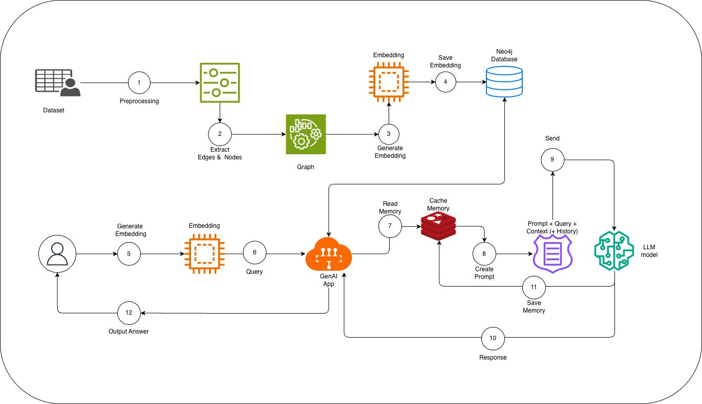

# Kiến trúc Hệ thống Phân tích Tin tức & Sinh văn bản dựa trên Tri thức đồ thị (GraphRAG)

Dự án này xây dựng một hệ thống RAG (Retrieval-Augmented Generation) nâng cao, kết hợp giữa **Cơ sở dữ liệu Đồ thị (Neo4j)**, **Vector Embedding** và **Mô hình Ngôn ngữ Lớn (LLM)**. Hệ thống có khả năng trích xuất thông tin, xây dựng Knowledge Graph từ dữ liệu thô và trả lời câu hỏi của người dùng theo ngữ cảnh kèm theo bộ nhớ hội thoại (Memory Cache).

## System Pipeline (Sơ đồ Hệ thống)


*(Lưu ý: Đổi tên file ảnh thành tiếng Anh không dấu, ví dụ `system-pipeline.png` và cập nhật lại đường dẫn ở trên để hiển thị tốt nhất trên GitHub)*

---

## Quy trình Hoạt động (Workflow)

Hệ thống được chia làm hai luồng (pipeline) chính: **Luồng Nhập liệu (Data Ingestion)** và **Luồng Truy vấn (Query & Generation)**.

### Luồng 1: Xử lý dữ liệu và Xây dựng Đồ thị (Top Pipeline)
Quá trình này biến đổi dữ liệu dạng bảng/văn bản thô thành mạng lưới tri thức và lưu vào Neo4j.
* **(1) Preprocessing:** Tiền xử lý tập dữ liệu thô (Dataset) để làm sạch và chuẩn hóa.
* **(2) Extract Edges & Nodes:** Trích xuất các thực thể (Nodes) và mối quan hệ (Edges) từ dữ liệu để hình thành cấu trúc Đồ thị (Graph).
* **(3) Generate Embedding:** Đưa các thông tin đồ thị qua mô hình nhúng (Embedding Model) để chuyển đổi văn bản/thực thể thành các vector toán học.
* **(4) Save Embedding:** Lưu trữ các Nodes, Edges và Vector Embeddings vào cơ sở dữ liệu **Neo4j Database**.

### Luồng 2: Truy vấn và Sinh câu trả lời với LLM (Bottom Pipeline)
Quá trình xử lý câu hỏi của người dùng theo thời gian thực (Real-time).
* **(5) Generate Embedding (User):** Người dùng nhập câu hỏi. Câu hỏi này ngay lập tức được biến đổi thành Vector thông qua Embedding model.
* **(6) Query:** Câu hỏi được gửi đến Ứng dụng trung tâm (GenAI App). Ứng dụng này sẽ tiến hành truy xuất (Retrieve) các ngữ cảnh liên quan (Context) từ **Neo4j Database** dựa trên độ tương đồng vector và mối quan hệ đồ thị.
* **(7) Read Memory:** GenAI App truy xuất lịch sử trò chuyện cũ từ **Cache Memory** (có thể là Redis hoặc In-memory) để hiểu ngữ cảnh của cuộc hội thoại.
* **(8) Create Prompt:** Tổng hợp dữ liệu để tạo ra một Prompt hoàn chỉnh bao gồm: `Câu lệnh gốc (Prompt) + Câu hỏi (Query) + Ngữ cảnh từ Neo4j (Context) + Lịch sử hội thoại (History)`.
* **(9) Send to LLM:** Gửi Prompt hoàn chỉnh này tới **LLM Model** để xử lý và suy luận.
* **(10) Response:** LLM trả về câu trả lời cho GenAI App.
* **(11) Save Memory:** Câu trả lời mới được lưu ngược lại vào **Cache Memory** để phục vụ cho các câu hỏi tiếp theo của người dùng.
* **(12) Output Answer:** Trả về câu trả lời cuối cùng hiển thị cho Người dùng.

---

## Tech Stack (Công nghệ sử dụng)

* **Database:** 
  * `Neo4j` (Lưu trữ Knowledge Graph & Vector Search)
  * `PostgreSQL` (Lưu trữ Metadata & các dữ liệu cấu trúc khác như giá chứng khoán/tin tức)
* **Backend / App:** Python (FastAPI / LangChain hoặc LlamaIndex - *Tùy chỉnh theo code của bạn*)
* **AI / ML:** LLM Models, Embedding Models.
* **Infrastructure:** Docker & Docker Compose để quản lý container.

---

## Hướng dẫn Cài đặt & Khởi chạy (Getting Started)

### 1. Yêu cầu hệ thống
* Cài đặt [Docker](https://docs.docker.com/get-docker/) và Docker Compose.
* Môi trường Python 3.9+ (nếu chạy code local).

### 2. Thiết lập môi trường
Tạo file `.env` ở thư mục gốc chứa cấu hình bảo mật dựa trên file `.env.example`:
```bash
# Ví dụ nội dung file .env
DB_USER=minh_admin
DB_PASSWORD=your_secret_password
DB_NAME=news_intelligence
PGADMIN_EMAIL=admin@admin.com
PGADMIN_PASSWORD=your_secret_password
# Cài đặt Pipeline: Bước 3 & Bước 4

Tài liệu này mô tả mã nguồn Python để thực hiện quá trình tạo Vector Embedding từ dữ liệu văn bản và lưu trữ vào cơ sở dữ liệu đồ thị Neo4j.

## Yêu cầu thư viện

Trước khi chạy code, cần cài đặt các thư viện hỗ trợ:

```bash
pip install neo4j sentence-transformers python-dotenv